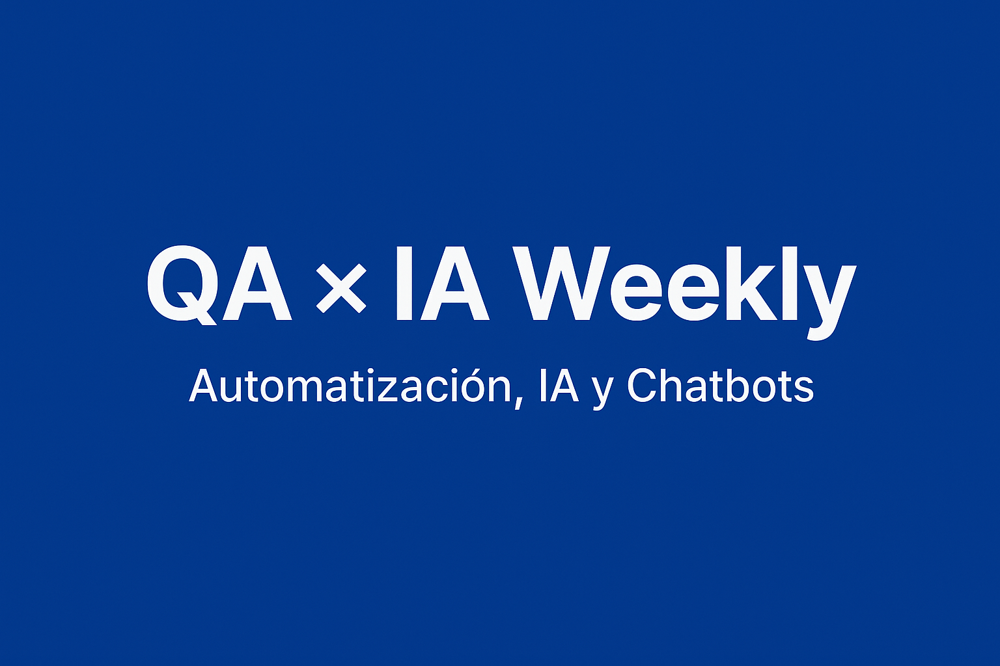

## 1. ¿Quién soy?

¡Hola! Soy **Alberto Barragán**, ingeniero informático con casi una década en calidad de software:

* 2011-2016 — doble grado en Ingeniería Informática e Ingeniería de Computadores.  
* 2016-2024 — QA Automation en proyectos fintech y sanitario: Java + Selenium/Appium, Javascript + WebdriverIO, Karate, Reporting...
* 2024 — Máster en Inteligencia Artificial: investigación en OCR multimodal + traducción EN→ES.  
* Experimentos recurrentes con **chatbots** (WhatsApp + Google Calendar, Skill de Alexa...).

Mi motivación: **hacer que la calidad impulse al producto**, no que lo retrase ( y si puede ser ayudados por la IA, mejor)

---

## 2. Por qué nace *QA × IA Weekly*

1. **Falta de recursos en español** donde se junten automatización, patrones QA modernos y LLMs.  
2. Compartir en público me obliga a poner las ideas en orden (y el feedback de la comunidad creo que me ayudará mucho).  
3. Cada vez que cuento un PoC a un compañero, aparece alguien que dice:  
   > “¡Ojalá hubiera un paso-a-paso para probar eso en mi proyecto!”  
   Quiero convertir este blog en ese paso-a-paso.

---

## 3. ¿Qué voy a publicar exactamente?

| Elemento semanal | Contenido | Por qué te interesa |
|------------------|-----------|---------------------|
| 🛠 **PoC runnable** | Script, repo o docker que arranca en < 5 min. | Puedes copiarlo sin tener que picar código. |
| 👀 **GIF / diagrama** | Demo visual rápida: “antes → después”. | Entiendes su función sin compilar nada. |
| 📖 **Explicación detallada** | Qué problema resolvemos, diseño de la solución y límites. | Ahorra horas de prueba-error. |

> **Nota:** si en algún PoC dispongo de datos duros (tiempo ahorrado, failure-rate, etc.) también los compartiré.

---

## 4. Roadmap trimestre 1

| Semana | Tema |
|-------:|------|
| 1 | Presentación & declaración de intenciones |
| 2 | De documentación + mock-ups → casos de uso con Llama 3 + LLaVA |
| 3 | Generador de datos sintéticos para tests parametrizados |
| 4 | Casos de uso → código Selenium con ayuda de un LLM |
| 5 | Visual regression con AShot + GPT-Vision |
| ... | ... |

*(El orden puede variar según preguntas que reciba o noticias del sector.)*

---

## 5. Qué **no** encontrarás

* Post motivacionales vacíos: todo vendrá con código o disección técnica. Excepto en los que hable de mi o de mi opinión personal, que siempre los intentaré acompañar de datos reales y técnicos. 
* Críticas a frameworks sin experimentos que las respalden.
* Cómo hacer una IA que resuelva todos los problemas de la automatización de pruebas

---

## 6. Cómo participar

1. **Comenta** qué te ha parecido el post. Me ayudarás a saber si voy en la dirección correcta o no. Me gustaría saber tu opinión sobre el tema y sobre cómo lo he contado ( si te ha parecido fácil, difícil, entendible... ), además del reto QA × IA que más te duele; priorizaré los temas más comentados.  
2. ⭐️ Dale *star* al repo si un PoC te resulta útil: es la forma más clara de feedback.  
3. Comparte los posts con tu equipo si crees que pueden ahorrarles tiempo.

Nos vemos la próxima semana con el PoC #1. Espero que sea de tu agrado ¡Gracias por leer!

